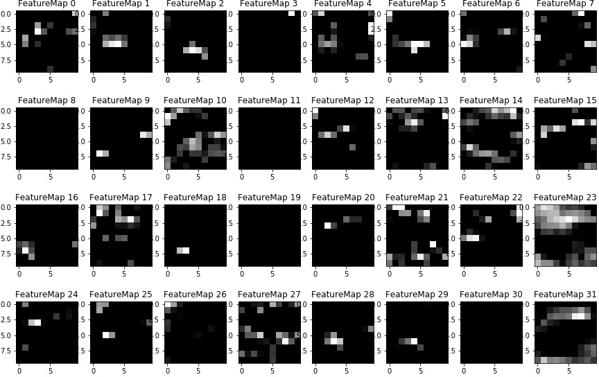
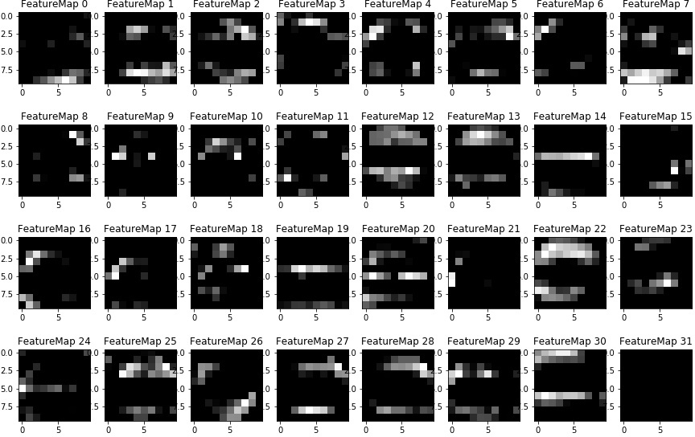

# **Traffic Sign Recognition** 

### Dataset Exploration
#### 1. Dataset Summary 
* Number of training examples = 34799
* Number of validation examples = 4410
* Number of testing examples = 12630
* Number of classes = 43
* Input image data shape = (32, 32, 3)

#### 2. Exploratory Visualization 
Here is an example of 43 traffic signes from the dataset. 

Here is the distribution of classes. Some signs have more examples, which could result a more accurate prediction on those signs. The distribution of the training set is similar to those of the validation and test sets. If the model is not overfit, the overall accuracy on the validation and test sets should not be too different from that of the training set.

### Design and Test a Model Architecture

#### 1. Preprocessing
The image has been normalized by subtracting the mean of the image (flatten array of all three channels) and dividing by the standard deviation of the image. This makes all the feature center around zero and have unit variance. Normalization helps the algorithm learn features from low-contrast images better. 

#### 2. Model Architecture 
I use [LeNet-5](https://github.com/udacity/CarND-LeNet-Lab) taught in the Convolutional Neural Network lesson as my model. It consists of the following layers:

| Layer         		|     Description	        					| 
|:---------------------:|:---------------------------------------------:| 
| Input         	      	| 32x32x3 RGB image   							| 
| 1. Convolution 5x5     	| 1x1 stride, valid padding, outputs 28x28x24 	|
| 1. RELU					            |												|
| 1. Max pooling	      	  | 2x2 stride,  outputs 14x14x24 				|
| 2. Convolution 5x5	     | 1x1 stride, valid padding, outputs 10x10x32 |
| 2. RELU					            |												|
| 2. Max pooling	      	  | 2x2 stride,  outputs 5x5x32 				|
| Flatten              | outputs 800 |
| 3. Fully connected		    | outputs 120 |
| 3. RELU					            |												|
| 4. Fully connected		    | outputs 80 |
| 4. RELU					            |												|
| 5. Fully connected		    | outputs 43 | 

#### 3. Model Training

To train the model, I used an ....

#### 4. Solution Approach

Describe the approach taken for finding a solution and getting the validation set accuracy to be at least 0.93. Include in the discussion the results on the training, validation and test sets and where in the code these were calculated. Your approach may have been an iterative process, in which case, outline the steps you took to get to the final solution and why you chose those steps. Perhaps your solution involved an already well known implementation or architecture. In this case, discuss why you think the architecture is suitable for the current problem.

* training set accuracy = 100%
* validation set accuracy = 96.5% 
* test set accuracy = 95.4%

If an iterative approach was chosen:
* What was the first architecture that was tried and why was it chosen?
* What were some problems with the initial architecture?
* How was the architecture adjusted and why was it adjusted? Typical adjustments could include choosing a different model architecture, adding or taking away layers (pooling, dropout, convolution, etc), using an activation function or changing the activation function. One common justification for adjusting an architecture would be due to overfitting or underfitting. A high accuracy on the training set but low accuracy on the validation set indicates over fitting; a low accuracy on both sets indicates under fitting.
* Which parameters were tuned? How were they adjusted and why?
* What are some of the important design choices and why were they chosen? For example, why might a convolution layer work well with this problem? How might a dropout layer help with creating a successful model?

If a well known architecture was chosen:
* What architecture was chosen?
* Why did you believe it would be relevant to the traffic sign application?
* How does the final model's accuracy on the training, validation and test set provide evidence that the model is working well?
 

### Test a Model on New Images

Here are five German traffic signs that I found on the web:

The second image might be challenging because the image resolution is low and the colors have faded.  The last one is partially covered by the snow. 

Here are the results of the prediction:

| Image			              |     Prediction	        					| 
|:---------------------:|:---------------------------------------------:| 
| Bumpy road               | Bumpy road   									| 
| Keep left     		         | Yield 										|
| Speed limit (30km/h)					| Speed limit (30km/h)											|
| No passing               | No passing					 				|
| General caution			       | General caution     							|

4 out of 5 predictions are correct, which gives an accuracy of 80%.

The top five soft max probabilities for each images are

| Image			              |    1st    |    2nd    |    3rd    |    4th    |    5th   |    
|:---------------------:|:----------|-----------|-----------|-----------|---------:| 
| Bumpy road            | 1.00e+00  | 1.96e-08  | 7.57e-09  | 2.09e-15  | 1.02e-16 |
| Keep left             | 6.94e-01  | 2.55e-01  | 3.60e-02  | 1.40e-02  | 3.42e-05 |
| Speed limit (30km/h)  | 9.99e-01  | 5.98e-08  | 4.23e-10  | 2.31e-11  | 1.79e-11 |
| No passing            | 1.00e+00  | 8.14e-22  | 2.82e-24  | 2.01e-27  | 6.92e-31 |
| General caution       | 1.00e+00  | 2.17e-14  | 4.45e-16  | 1.96e-19  | 1.74e-19 |

The predictions are all very certain except for the second image.  The top 5 guesses for the second image are the following: Yield (69%), Keep left (26%), Go straight or left (4%), Turn left ahead (1%), Ahead only (0.003%). It’s interesting that the model thinks the second image, Keep left (round), as Yield (triangle). Maybe it mistakenly selects the arrow head as the area of interest.

### Visualizing the Neural Network
Here are the features that activate the neurons of the first convolutional layer. It seems to recognize all the major shape and pattern of the sign.

* Bumpy road

* Keep left

* Speed limit (30km/h)

* No passing

* General caution 

Here is the visualization of the second convolutional layer. The pattern is difficult to recognize. 
* Bumpy road

* Keep left

* Speed limit (30km/h)

* No passing

* General caution 

