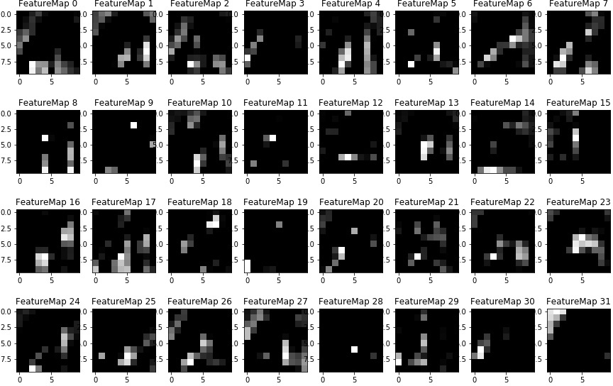

# **Traffic Sign Recognition** 

### Dataset Exploration
#### 1. Dataset Summary 
* Number of training examples = 34799
* Number of validation examples = 4410
* Number of testing examples = 12630
* Number of classes = 43
* Input image data shape = (32, 32, 3)

#### 2. Exploratory Visualization 
Here is an example of 43 traffic signes from the dataset. 

Here is the distribution of classes. Some signs have more examples, which could result a more accurate prediction on those signs. The distribution of the training set is similar to those of the validation and test sets. If the model is not overfit, the overall accuracy on the validation and test sets should not be too different from that of the training set.

### Design and Test a Model Architecture

#### 1. Preprocessing
The image has been normalized by subtracting the mean of the image across three channels and dividing by the standard deviation of the image. This makes all the feature center around zero and have unit variance. Normalization helps the algorithm learn features from low-contrast images better. 

#### 2. Model Architecture 
I use [LeNet-5](https://github.com/udacity/CarND-LeNet-Lab) taught in the Convolutional Neural Network lesson as my model. It consists of the following layers:

| Layer         		|     Description	        					| 
|:---------------------:|:---------------------------------------------:| 
| Input         	      	| 32x32x3 RGB image   							| 
| 1. Convolution 5x5     	| 1x1 stride, valid padding, outputs 28x28x24 	|
| 1. RELU					            |												|
| 1. Max pooling	      	  | 2x2 stride,  outputs 14x14x24 				|
| 2. Convolution 5x5	     | 1x1 stride, valid padding, outputs 10x10x32 |
| 2. RELU					            |												|
| 2. Max pooling	      	  | 2x2 stride,  outputs 5x5x32 				|
| Flatten              | outputs 800 |
| 3. Fully connected		    | outputs 120 |
| 3. RELU					            |												|
| 4. Fully connected		    | outputs 80 |
| 4. RELU					            |												|
| 5. Fully connected		    | outputs 43 | 

The last layer outputs the logits of 43 classes and feeds to  _tf.nn.softmax_cross_entropy_with_logits_, which performs softmax activation on logits and creates a cross-entropy loss. The loss function is minimized by _tf.train.AdamOptimizer_.

#### 3. Model Training

The batch size was initially set at 512, which gave a validation accuracy of 0.91. As the batch size decreases, it introduces more randomness to the gradient descent method and the optimization gets better.  A batch size that is too small may learn very slowly. The final model uses a batch size of 96.

The number of epochs is determined by the validation accuracy. The model keeps training until the absolute difference of the validation accuracy of the current and the previous epoch is smaller than 0.0002. It typically takes 20-50 epochs to converge.

I use grid search to find the hyperparameters of the network architecture, specifically the filter size of the convolution layers, d1 and d2, the output size of the fully connected layers, d3 and d4. The convolution kernel size, stride, max pooling window size are fixed at the values used in LeNet-5 lesson. The grid search results are listed in [here](./architecture/README.md) with best d1, d2, d3, d4 at 24, 32, 120, 80 respectively.

#### 4. Solution Approach

Here is the performance of the model.
* training set accuracy = 100%
* validation set accuracy = 96.5% 
* test set accuracy = 95.4%

The model is overfitted because the training accuracy is bigger than the accuracy on the test set. Adding dropout to layer 3 increases the validation accuracy by 1% and the test accuracy by 0.5%. Details are shown in [here](./dropout/README.md). I also tried to decrease the convolution kernel size to 3x3 in the hope that the model could recognize smaller features better. It didn’t perform as well as 5x5 convolutio. 

### Test a Model on New Images

Here are five German traffic signs that I found on the web:

The second image (Keep left) might be challenging because the image resolution is low and the colors have faded.  The last one is partially covered by the snow. 

Here are the results of the prediction:

| Image			              |     Prediction	        					| 
|:---------------------:|:---------------------------------------------:| 
| Bumpy road               | Bumpy road   									| 
| Keep left     		         | Yield 										|
| Speed limit (30km/h)					| Speed limit (30km/h)											|
| No passing               | No passing					 				|
| General caution			       | General caution     							|

4 out of 5 predictions are correct, which gives an accuracy of 80%.

The top five soft max probabilities for each images are

| Image			              |    1st    |    2nd    |    3rd    |    4th    |    5th   |    
|:---------------------:|:----------|-----------|-----------|-----------|---------:| 
| Bumpy road            | 1.00e+00  | 1.96e-08  | 7.57e-09  | 2.09e-15  | 1.02e-16 |
| Keep left             | 6.94e-01  | 2.55e-01  | 3.60e-02  | 1.40e-02  | 3.42e-05 |
| Speed limit (30km/h)  | 9.99e-01  | 5.98e-08  | 4.23e-10  | 2.31e-11  | 1.79e-11 |
| No passing            | 1.00e+00  | 8.14e-22  | 2.82e-24  | 2.01e-27  | 6.92e-31 |
| General caution       | 1.00e+00  | 2.17e-14  | 4.45e-16  | 1.96e-19  | 1.74e-19 |

The predictions are all very certain except for the second image.  The top 5 guesses for the second image are the following: Yield (69%), Keep left (26%), Go straight or left (4%), Turn left ahead (1%), Ahead only (0.003%). It’s interesting that the model thinks the second image, Keep left (round), as Yield (triangle). Maybe it mistakenly selects the head of left arrow as the area of interest. 

The softmax probability of each class of the second image is shown below (in sqrt scale). Also plotted is the average prediction of Keep left sign (#39) in the test set. The model has some troubles distinguish Keep left from Traffic signals (#26), Turn right ahead (#33), Turn left ahead (#34), Keep right (#38), but it rarely thinks Keep left as Yield. Note that Traffic signals (#26) is also a triangle sign with red border. 

### Visualizing the Neural Network
Here are the features that activate the neurons of the first convolutional layer. It seems to recognize all the major shape and pattern of the sign.

* Bumpy road

* Keep left

* Speed limit (30km/h)

* No passing

* General caution 

Here is the visualization of the second convolutional layer. The pattern is difficult to recognize. 
* Bumpy road

* Keep left

* Speed limit (30km/h)

* No passing

* General caution 

