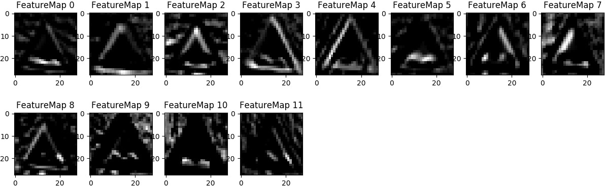
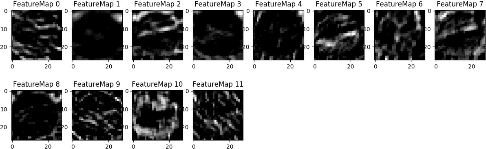
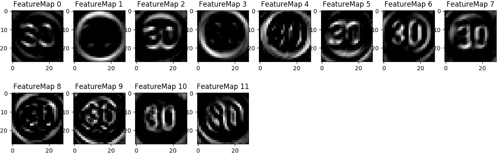
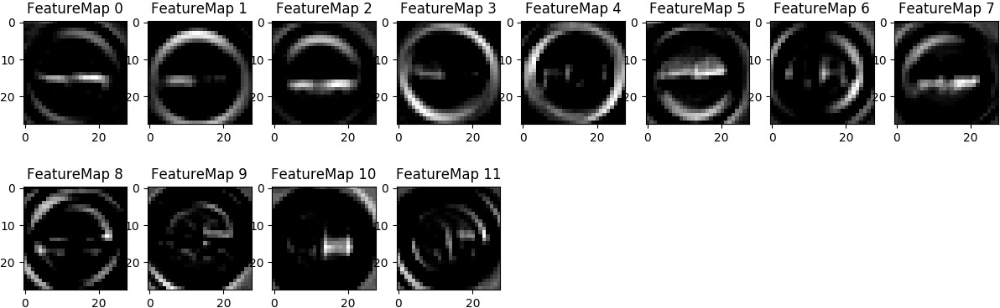
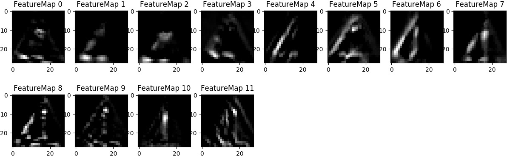
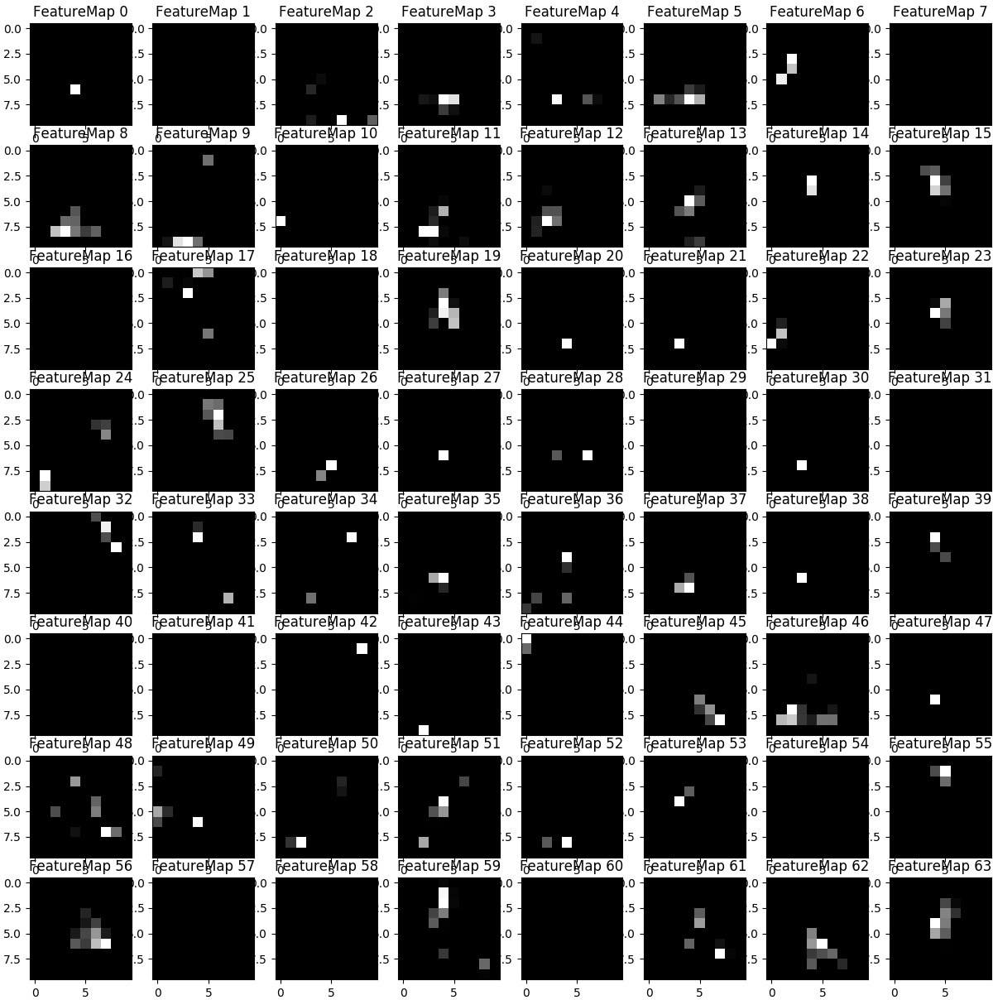

# Data augmentation

Here I augment the training set by translating the image by 3 pixels in 4 directions (up, down, left, right), rotating the image by 5-15 degrees clockwise or counterclockwise, and zooming out the image by 14%.
```
def fakeData(X):
    n=len(X)
    X1 = []
    for i in range(n):
        p=np.random.random()
        m=np.mean(X[i])
        if p < 0.4:  #translation
            t = np.zeros(X[i].shape,dtype=np.float32) + m
            if p < 0.1:
                t[0:29,:,:] = X[i][3:,:,:]
            elif p < 0.2:
                t[3:,:,:] = X[i][0:29,:,:]
            elif p < 0.2:
                t[:,0:29,:] = X[i][:,3:,:]
            else:
                t[:,3:,:] = X[i][:,0:29,:]
        elif p < 0.6: #rotation
            t = scipy.misc.imrotate(X[i], np.random.random()*10+5)
            idx = np.nonzero(t==0)
            t[idx] = m
        elif p < 0.8: #rotation
            t = scipy.misc.imrotate(X[i], -np.random.random()*10-5)
            idx = np.nonzero(t==0)
            t[idx] = m
        else: #zooming
            t = scipy.misc.imresize(X[i][2:30,2:30,:], (32,32,3))
        X1.append(t)
    return np.concatenate((X, np.array(X1)), axis=0)

```

There may be some zero value pixels after the transformation. I fill those pixels with the mean value of the image and then scale it before the training. _fakeData_ doubles the amount of the original data, giving a training set of 69598 in size.

The batch size is 192 and the learning rate is 0.001. The model keeps training until the absolute difference of the validation accuracy of the current and the previous epoch is less than 0.0002 or reaching the maximum epoch of 40. Throughout the iterations, only the models with the best validation accuracy seen so far will be saved. The accuracy is evaluated from the model with the best accuracy on the validation set. The results of various models are listed below.

epoch | d1   | d2 |  d3 | d4  |dropout| validation accuracy    | valid acc/train acc   | test accuracy
------|------|----|-----|-----|-------|------------------------|-----------------------|--------
 16   |24    | 32 |120  |80   |0.6    |0.9654 |0.9964 |0.9671
 21   |24    | 32 |120  |80   |0.7    |0.9693 |1.0040 |0.9703
 40   |12    | 64 |240  |80   |0.7    |0.9776 |0.9877 |0.9675
 40   |12    | 64 |240  |80   |0.8    |0.9800 |0.9927 |0.9743

Here are some of the visualizations of the first convolutional layer of the best model (model_12_64_240_80_b192_r0.001_d0.8) in case anyone is curious.

* Bumpy road

* Keep left

* Speed limit (30km/h)

* No passing

* General caution


The second convolutional layer looks like this.

